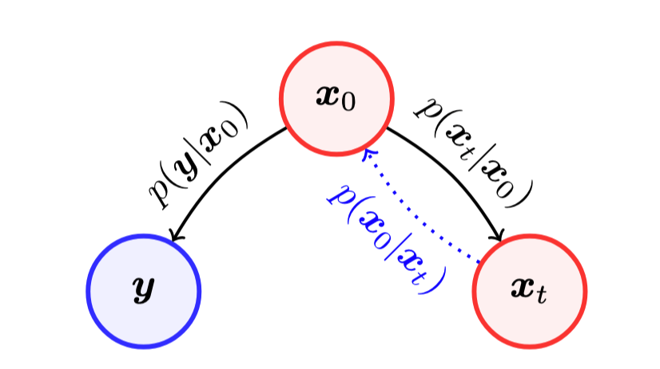

# DPS with non exponential noise

Implementation of Diffusion Posterior Sampling [[Chung et al.2022]](https://arxiv.org/abs/2209.14687) and extension to Noisy Inverse Problem with Cauchy Noise.

## Diffusion Posterior Sampling

DPS main principle is to sample images from the posterior distribution $\mathbf{x}_t | \mathbf{y}$ using the following reverse SDE in order to recover $\mathbf{x}_0$ from $\mathbf{y} = \mathcal{A}(\mathbf{x}_0) + \mathbf{n}$

$$
d\mathbf{x} = \left[ -\dfrac{\beta(t)}{2}\mathbf{x} - \beta(t)\nabla_{\mathbf{x}_t}\log p_t(\mathbf{x}_t | \mathbf{y})\right]dt + \sqrt{\beta(t)}d\overline w
$$

The score term $\nabla_{\mathbf{x}_t}\log p_t(\mathbf{x}_t | \mathbf{y})$ can be computed using Bayes formula

$$
\nabla_{\mathbf{x}_t}\log p_t(\mathbf{x}_t | \mathbf{y}) = \nabla_{\mathbf{x}_t}\log p_t(\mathbf{x}_t) + \nabla_{\mathbf{x}_t}\log p_t(\mathbf{y} | \mathbf{x}_t)
$$

The first term is an unconditional score that can be approximated using a neural network trained with denoising score matching. As shown below, the log-likelihood is still untractable because $\mathbf{x}_t$ and $\mathbf{y}$ are not directly related

<div style="text-align:center">
  
</div>

The further approximation makes the term tractable $\nabla_{\mathbf{x}_t}\log p_t(\mathbf{y} | \mathbf{x}_t) \approx \nabla_{\mathbf{x}_t}\log p_t(\mathbf{y} | \mathbf{x}_0)$. The form of the distribution $p_t(\mathbf{y} | \mathbf{x}_0)$ only depends on the distribution of the noise $\mathbf{n}$. 

If $\mathbf{n} \sim \mathcal{N}(0, \sigma^2\mathbf{I})$ then,

$$
\nabla_{\mathbf{x}_t}\log p_t(\mathbf{y} | \mathbf{x}_0) = -\dfrac{1}{2\sigma^2}\nabla_{\mathbf{x}_t}||\mathbf{y} - \mathcal{A}(\mathbf{x}_0)||_2^2
$$

If $\mathbf{n} \sim \mathcal{P}(\lambda)$, the authors shows that we can use the following approximation

$$
\nabla_{\mathbf{x}_t}\log p_t(\mathbf{y} | \mathbf{x}_0) \approx -\nabla_{\mathbf{x}_t}||\mathbf{y} - \mathcal{A}(\mathbf{x}_0)||_\mathbf{\Lambda}^2, \quad [\mathbf{\Lambda}]_{ii} = \dfrac{1}{2\mathbf{y}_i}
$$
where $||\mathbf{a}||_\mathbf{\Lambda}^2 = \mathbf{a}^\top\mathbf{\Lambda}\mathbf{a}$.

Below, we suggest a novel approximation for the case of Cauchy noise, a non-exponential noise with heavy tail. If $\mathbf{n} \sim \text{Cauchy}(\gamma)$ then,

$$
\nabla_{\mathbf{x}_t}\log p_t(\mathbf{y} | \mathbf{x}_0) \approx -\dfrac{1}{\gamma^2}\nabla_{\mathbf{x}_t}||\mathbf{y} - \mathcal{A}(\mathbf{x}_0)||_2^2
$$

(Justification of the latter approximation can be found in the report in the repo)

All those approximations are gradient steps on the data fidelity term, thus easy to implement whatever the operator $\mathcal{A}$.


## Getting Started

Clone the repository

```
git clone https://github.com/a-lagier/DPS-Cauchy

cd DPS-Cauchy
```

### Other code projects to import

We use the external codes for motion-blurring and non-linear deblurring.

```
git clone https://github.com/VinAIResearch/blur-kernel-space-exploring bkse

git clone https://github.com/LeviBorodenko/motionblur motionblur
```

### Install dependencies

```
conda create -n DPS python=3.8

conda activate DPS

pip install -r requirements.txt

pip install torch torchvision deepinv lpips gdown datetime
```

### Download pretrained checkpoint

From the [link](https://drive.google.com/drive/folders/1jElnRoFv7b31fG0v6pTSQkelbSX3xGZh?usp=sharing), download the checkpoint "ffhq_10m.pt" and paste it to ./models/

```
mkdir models
mv {DOWNLOAD_DIR}/ffqh_10m.pt ./models/
```

{DOWNLOAD_DIR} is the directory that you downloaded checkpoint to.

### Side Note

If necessary create the following folders

```
mkdir -p results/progress logs models
```

## Inference

The dir configs/ will contain basic DPS configs ready to be ran with the following command

```
python main.py --cfg configs/motion-blur-cauchy-celeba.yaml
```

Here is the content of the file configs/motion-blur-cauchy-celeba.yaml

```
out_dir: ./results
device: cuda:0
sampling_size: 256 # if conditional choose it accordingly with dataset image size
model: unet
ckpt_file: ./models/ffhq_10m.pt
steps: 1000
seed: 0
channels: 3
batch_size: 10
conditional:
  use_conditional: True
  scale: 1.0
  dataset:
    name: CelebA
    dataset_dir: ./datasets/
    num_images: 250
  operator:
    name: motion-blur
    kernel_size : 61
    intensity: 0.5
  noise:
    name: cauchy
    scale: 1.0
metric:
  name: [lpips, psnr]
```

### Author

Alexandre Lagier
